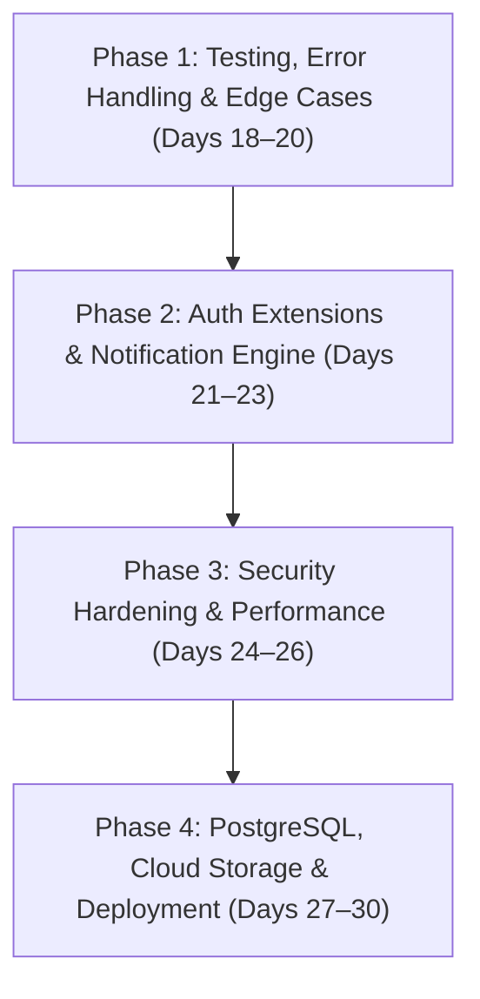

# 🚀 K9Match: Complete Project Roadmap (Phases 1 to 4)

This document contains the complete, phase-by-phase implementation plan for completing, securing, optimizing, and deploying the **K9Match Web Platform**.

---

## 📑 Roadmap Overview

---

## 🛡️ Phase 1: Testing, Error Handling & Edge Cases (Days 18–20) — [COMPLETED ✅]

### 1.1 Automated Unit & Integration Testing ✅
- **User Authentication & Permissions**:
  - Test registration, login, logout, and session lifecycle.
  - Verify protected routes require login (`/add-dog/`, `/dog/<id>/edit/`, `/chat/<id>/`, `/requests/`, `/my-dogs/`).
  - Verify unauthorized users are redirected to login with next-URL preservation.
- **Model Validation & Business Rules**:
  - **Self-Match Prevention**: Disallow sending a match request from or to a dog owned by the same user.
  - **Opposite-Gender Breeding Rule**: Validate that `sender_dog` and `target_dog` have opposite genders (Male + Female).
  - **Duplicate Prevention**: Prevent duplicate pending match requests between the same dogs/users.
- **Permission Access Auditing**:
  - Verify that only the participating owners can enter a chat room for an accepted match.
  - Verify that non-owners cannot edit or delete someone else's dog profile.

### 1.2 Form & Input Validation Edge Cases ✅
- **Image Upload Hardening**:
  - File size validator: Reject image uploads larger than **5MB**.
  - File extension & MIME enforcement: Restrict strictly to `.jpg`, `.jpeg`, and `.png`.
  - Handle profile creation gracefully without photos, adding an encouragement prompt: *"Add a photo to increase the chance of finding a breeding partner!"* with a direct upload button.
- **Age & Numeric Field Constraints**:
  - Added validators to prevent negative age or implausible values (`0 <= age_years <= 25`).
  - Restrict `age_months` strictly between `0` and `11`.
- **Chat & Message Input Sanitization**:
  - Reject empty or whitespace-only messages.
  - HTML tag stripping to eliminate Cross-Site Scripting (XSS) risks on live chat streams.

### 1.3 Custom Branded HTTP Error Pages ✅
- Custom user-friendly templates matching the K9Match aesthetic:
  - **`404.html`** (Page Not Found): Helpful navigation links back to Home, Find Matches, and My Dogs.
  - **`403.html`** (Permission Denied): Explains access restrictions with return CTAs.
  - **`500.html`** (Internal Server Error): Polite error message with support contact info.
- Configured Django custom error handlers in `config/urls.py` (`handler404`, `handler403`, `handler500`).

---

## 🔐 Phase 2: Authentication Extensions & Notification Engine (Days 21–23)

### 2.1 Third-Party & Account Authentication
- **Google OAuth2 Social Sign-In**:
  - Integrate `django-allauth` for seamless one-click Google login and sign-up.
  - Custom adapter to ensure user profiles, roles, and usernames are configured on first login.
- **Email Verification Lifecycle**:
  - Token-based email verification on registration.
  - Verification email dispatch with signed activation links.
  - Custom activation landing page and resend-verification flow.
- **End-to-End Password Reset Flow**:
  - Password reset request view with email dispatch.
  - Secure, timed token generation (`PasswordResetTokenGenerator`).
  - Branded Password Reset Confirm and Password Reset Complete pages.

### 2.2 Transactional Email Notification System
- **SMTP Provider Integration**:
  - Configure production-grade SMTP backend (SendGrid, Amazon SES, or Mailgun) with fallback support for local console in development.
- **Automated Responsive HTML Email Templates**:
  - **New Match Proposal**: Sent to the dog owner when a breeding request is received, with a direct CTA button to review the proposal.
  - **Match Accepted Notification**: Sent to the sender with a "Chat Now" CTA.
  - **Match Declined Notification**: Polite update to the sender.

### 2.3 In-App Alerts & Activity Badges
- **Unread Message & Pending Request Badges**:
  - Dynamic navbar notification counter for unread messages and pending incoming match requests.
- **Live Visual Alerts (Toast Notifications)**:
  - Floating toast notifications in the UI when match request statuses change or new messages arrive.

---

## ⚡ Phase 3: Security Hardening & Performance Optimization (Days 24–26)

### 3.1 Environment Configuration & Secrets Management
- **Decouple Secrets via `.env`**:
  - Install and configure `python-decouple` / `django-environ`.
  - Extract `SECRET_KEY`, `DEBUG`, database credentials, OAuth client secrets, and SMTP passwords into `.env`.
  - Provide a clean `.env.example` template.
  - Confirm `.env` is ignored in `.gitignore`.

### 3.2 Security Middleware & Production Flags
- **Production Security Headers**:
  - Set `DEBUG = False` and define strict `ALLOWED_HOSTS`.
  - Enable `SECURE_BROWSER_XSS_FILTER = True`.
  - Enable `SECURE_CONTENT_TYPE_NOSNIFF = True`.
  - Configure `X_FRAME_OPTIONS = 'DENY'`.
  - Enforce `CSRF_COOKIE_SECURE = True` and `SESSION_COOKIE_SECURE = True`.
  - Enforce HTTPS redirection (`SECURE_SSL_REDIRECT = True`) and HTTP Strict Transport Security (HSTS) flags.

### 3.3 Database & Query Optimization
- **Eliminate N+1 Query Bottlenecks**:
  - Audit all queryset evaluations in `core/views.py`.
  - Add `select_related('owner', 'target_dog', 'sender_dog')` and `prefetch_related('images')`.
- **Database Indexing**:
  - Add `db_index=True` or `models.Index` on high-traffic filter fields: `breed`, `city`, `state`, `gender`, `is_available`, and `approval_status`.

---

## 🌐 Phase 4: Database Migration, Static Storage & Deployment (Days 27–30)

### 4.1 Production PostgreSQL Migration
- Provision production PostgreSQL database (e.g. Supabase, Neon, or cloud host DB).
- Install `psycopg2-binary` and `dj-database-url`.
- Configure conditional `DATABASES` settings (PostgreSQL in production, SQLite fallback for local testing).
- Execute migrations and migrate existing seed dog/user data from SQLite to PostgreSQL.

### 4.2 Static & Media Cloud Storage
- **Static Assets (WhiteNoise)**:
  - Configure WhiteNoise middleware for compressed, persistent static asset serving (CSS, JS, fonts).
- **Persistent Media Storage (Cloud Object Storage)**:
  - Connect cloud object storage (AWS S3, Cloudinary, or Supabase Storage) via `django-storages` so uploaded dog photos persist across cloud container rebuilds.

### 4.3 Cloud Hosting Deployment
- Create deployment configuration:
  - `Procfile` for WSGI server process (`gunicorn config.wsgi:application`).
  - `runtime.txt` specifying the active Python version.
- Prepare deployment instructions for cloud platforms (Render, Railway, or VPS).
- Custom domain mapping & SSL certificate verification.

### 4.4 Final Live Verification
- End-to-end smoke test on Google Chrome:
  - Register new account via Google / Email.
  - Complete dog profile with images.
  - Verify search filters, distance calculations, and admin approval.
  - Send match proposals, verify email notifications, and conduct live chat.
