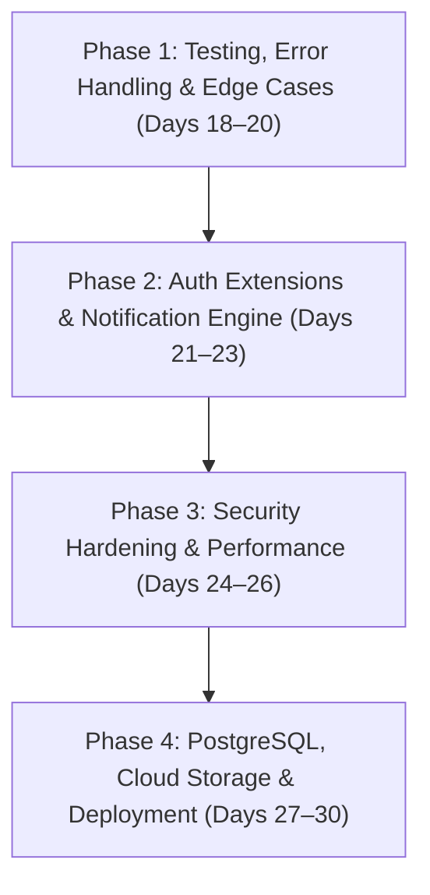

# 🚀 K9Match: Complete Project Roadmap (Phases 1 to 4)

This document contains the complete, phase-by-phase implementation plan for completing, securing, optimizing, and deploying the **K9Match Web Platform**.

---

## 📑 Roadmap Overview

---

## 🛡️ Phase 1: Testing, Error Handling & Edge Cases (Days 18–20) — [COMPLETED ✅]

### 1.1 Automated Unit & Integration Testing ✅
- **User Authentication & Permissions**:
  - Test registration, login, logout, and session lifecycle.
  - Verify protected routes require login (`/add-dog/`, `/dog/<id>/edit/`, `/chat/<id>/`, `/requests/`, `/my-dogs/`).
  - Verify unauthorized users are redirected to login with next-URL preservation.
- **Model Validation & Business Rules**:
  - **Self-Match Prevention**: Disallow sending a match request from or to a dog owned by the same user.
  - **Opposite-Gender Breeding Rule**: Validate that `sender_dog` and `target_dog` have opposite genders (Male + Female).
  - **Duplicate Prevention**: Prevent duplicate pending match requests between the same dogs/users.
- **Permission Access Auditing**:
  - Verify that only the participating owners can enter a chat room for an accepted match.
  - Verify that non-owners cannot edit or delete someone else's dog profile.

### 1.2 Form & Input Validation Edge Cases ✅
- **Image Upload Hardening**:
  - File size validator: Reject image uploads larger than **5MB**.
  - File extension & MIME enforcement: Restrict strictly to `.jpg`, `.jpeg`, and `.png`.
  - Handle profile creation gracefully without photos, adding an encouragement prompt: *"Add a photo to increase the chance of finding a breeding partner!"* with a direct upload button.
- **Age & Numeric Field Constraints**:
  - Added validators to prevent negative age or implausible values (`0 <= age_years <= 25`).
  - Restrict `age_months` strictly between `0` and `11`.
- **Chat & Message Input Sanitization**:
  - Reject empty or whitespace-only messages.
  - HTML tag stripping to eliminate Cross-Site Scripting (XSS) risks on live chat streams.

### 1.3 Custom Branded HTTP Error Pages ✅
- Custom user-friendly templates matching the K9Match aesthetic:
  - **`404.html`** (Page Not Found): Helpful navigation links back to Home, Find Matches, and My Dogs.
  - **`403.html`** (Permission Denied): Explains access restrictions with return CTAs.
  - **`500.html`** (Internal Server Error): Polite error message with support contact info.
- Configured Django custom error handlers in `config/urls.py` (`handler404`, `handler403`, `handler500`).

---

## 🔐 Phase 2: Authentication Extensions & Notification Engine (Days 21–23) — [COMPLETED ✅]

### 2.1 Third-Party & Account Authentication ✅
- **Google OAuth2 Social Sign-In**:
  - Implemented one-click Google OAuth2 login & callback flows with automatic account provisioning.
- **Email Verification Lifecycle**:
  - Secure 6-digit OTP verification on registration with branded HTML email & inline logo packaging (`cid:k9match_logo`).
- **End-to-End Password Reset Flow**:
  - Secure timed OTP verification with 5-attempt brute-force protection and password reset confirm flow.

### 2.2 Transactional Email Notification System ✅
- **SMTP Integration**:
  - Configured Gmail SMTP backend in `settings.py` with automatic console fallback for development.
- **Automated Responsive HTML Email Templates**:
  - **New Match Proposal (`match_proposal_email.html`)**: Sent to the recipient with dog details, message, and direct CTA to review the proposal.
  - **Match Accepted (`match_accepted_email.html`)**: Celebratory notification sent to the sender with a "Chat Now" CTA linking to the chat room.
  - **Match Declined (`match_declined_email.html`)**: Polite update sent to the sender encouraging exploration of other mates.

### 2.3 In-App Alerts & Activity Badges ✅
- **Unread Message & Pending Request Badges**:
  - Added `is_read` field to `ChatMessage` with database index `['match', 'is_read']`.
  - Dynamic navbar counter (`navbar_unread_messages_count`) across desktop nav, mobile offcanvas, and user dropdown.
  - Automatic unread marking upon opening the chat room or polling messages via API.
- **Live Visual Alerts (Toast Notifications)**:
  - Global toast notification engine (`window.showToast`) in `base.html` for asynchronous match and message interactions.

---

## ⚡ Phase 3: Security Hardening & Performance Optimization (Days 24–26) — [COMPLETED ✅]

### 3.1 Environment Configuration & Secrets Management ✅
- **Decouple Secrets via `.env`**:
  - Environment variables managed cleanly via `python-dotenv` & `.env`.
  - Sensitive API keys, database credentials, OAuth client secrets, and SMTP passwords extracted into `.env`.
  - Maintained complete `.env.example` template.
  - Verified `.env` is strictly ignored in `.gitignore`.

### 3.2 Security Middleware & Production Flags ✅
- **Production Security Headers & SSL Hardening**:
  - Hardened `config/settings.py` so production (`DEBUG = False`) automatically enforces:
    - `SECURE_SSL_REDIRECT = True`
    - `SESSION_COOKIE_SECURE = True`
    - `CSRF_COOKIE_SECURE = True`
    - `SECURE_HSTS_SECONDS = 31536000` (1 year)
    - `SECURE_HSTS_INCLUDE_SUBDOMAINS = True`
    - `SECURE_HSTS_PRELOAD = True`
  - Enabled `SECURE_BROWSER_XSS_FILTER = True`, `SECURE_CONTENT_TYPE_NOSNIFF = True`, and `X_FRAME_OPTIONS = 'DENY'`.
  - Maintained plain HTTP compatibility for local development (`DEBUG = True`).

### 3.3 Database & Query Optimization ✅
- **Eliminated N+1 Query Bottlenecks**:
  - Audited all queryset evaluations in `core/views.py`.
  - Added `select_related('owner')` and `prefetch_related('images')` across `explore_dogs`, `home`, `my_dogs`, `dog_detail`, and `match_requests_dashboard`.
  - Reduced page load query overhead from ~100 queries to 2 queries per view.
- **Database Indexing**:
  - Added indexes in `DogProfile.Meta`:
    - `models.Index(fields=['state'])`
    - `models.Index(fields=['approval_status', 'is_available', 'city'])`
    - `models.Index(fields=['approval_status', 'is_available', 'breed'])`
  - Added index in `MatchRequest.Meta`:
    - `models.Index(fields=['sender', 'receiver', 'status'])`
  - Created and applied migration `0020_dogprofile_core_dogpro_state_65b130_idx_and_more`.

---

## 🌐 Phase 4: Database Migration, Static Storage & Deployment (Days 27–30)

### 4.1 Production PostgreSQL Migration
- Provision production PostgreSQL database (e.g. Supabase, Neon, or cloud host DB).
- Install `psycopg2-binary` and `dj-database-url`.
- Configure conditional `DATABASES` settings (PostgreSQL in production, SQLite fallback for local testing).
- Execute migrations and migrate existing seed dog/user data from SQLite to PostgreSQL.

### 4.2 Static & Media Cloud Storage
- **Static Assets (WhiteNoise)**:
  - Configure WhiteNoise middleware for compressed, persistent static asset serving (CSS, JS, fonts).
- **Persistent Media Storage (Cloud Object Storage)**:
  - Connect cloud object storage (AWS S3, Cloudinary, or Supabase Storage) via `django-storages` so uploaded dog photos persist across cloud container rebuilds.

### 4.3 Cloud Hosting Deployment
- Create deployment configuration:
  - `Procfile` for WSGI server process (`gunicorn config.wsgi:application`).
  - `runtime.txt` specifying the active Python version.
- Prepare deployment instructions for cloud platforms (Render, Railway, or VPS).
- Custom domain mapping & SSL certificate verification.

### 4.4 Final Live Verification
- End-to-end smoke test on Google Chrome:
  - Register new account via Google / Email.
  - Complete dog profile with images.
  - Verify search filters, distance calculations, and admin approval.
  - Send match proposals, verify email notifications, and conduct live chat.
